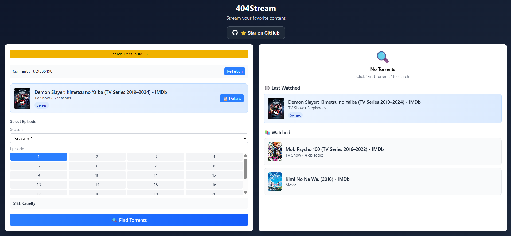

# 404Stream 🎬

<div align="center">


**Ultimate Anime Streaming Experience**

[](https://github.com/Saadiq8149/404Stream/stargazers)
[](https://github.com/Saadiq8149/404Stream/network)
[](https://github.com/Saadiq8149/404Stream/issues)
[](LICENSE)

</div>

## 🖥️ Platform Support

**Currently supports Windows only**. macOS and Linux support coming soon!


✨ **UI Disclaimer**:
- The extension UI was built with help **Claude Sonnet v4** because writing frontend code by hand is actual psychological warfare.
- Every time I adjusted display settings or margin or widths or messed with `flex` vs `grid`, a piece of my soul disintegrated.
- Tailwind makes things “easier,” they said — *they lied*.
- So yeah, "I used a bit of AI" — *a bit he lied*. If you like the UI, great. If you don't… well, blame the AI.


## 🌟 Features

###  **Core Functionality**
- ** Smart Content Discovery**: Search and stream movies & TV shows using IMDB IDs
- ** Auto Torrent Selection**: Intelligent torrent ranking with quality prioritization
- ** VLC Integration**: Seamless streaming directly to VLC Media Player
- ** Browser Extension**: Convenient popup interface for quick access

### **Advanced Features**
- ** Watch History**: Track watched content with episode progress
- ** Movie & Series Support**: Full support for both movies and TV shows
- ** Episode Navigation**: Easy season/episode selection and next episode functionality
- ** Multiple Sources**: Integration with Torrentio API for reliable content sources

###  **Technical Stack**
- **Backend**: FastAPI (Python)
- **Frontend**: React + Tailwind 
- **Media Player**: VLC integration for streaming
- **APIs**: IMDB scraping, Torrentio integration

## 🏗️ Architecture

### 📊 **System Overview**
```
┌─────────────────┐    ┌─────────────────┐    ┌─────────────────┐
│   Browser       │    │   FastAPI       │    │   External      │
│   Extension     │◄───┤   Backend       │◄───┤   APIs          │
│                 │    │                 │    │                 │
│ • React UI      │    │ • Torrent API   │    │ • Torrentio     │
│ • Tailwind CSS  │    │ • IMDB Scraper  │    │ • IMDB          │
│ • Chrome APIs   │    │ • VLC Control   │    │ • Subtitles     │
└─────────────────┘    └─────────────────┘    └─────────────────┘
         │                       │                       │
         └───────────────────────┼───────────────────────┘
                                 ▼
                    ┌─────────────────┐
                    │   VLC Media     │
                    │   Player        │
                    │                 │
                    │ • Stream Play   │
                    │ • Subtitle Sync │
                    └─────────────────┘
```

### 🗂️ **Project Structure**
```
404Stream/
├── backend/                 # FastAPI backend
│   ├── main.py             # Main server file
│   ├── requirements.txt    # Python dependencies
│   ├── routers/            # API route modules
│   │   ├── stream.py       # Streaming endpoints
│   │   └── torrents.py     # Torrent search
│   ├── services/           # Business logic
│   │   ├── torrentio.py    # Torrentio API client
│   │   ├── qbittorrent.py  # Torrent management
│   │   └── opensubs.py     # Subtitle services
│   └── downloads/          # Downloaded content
├── extension/              # Chrome extension
│   ├── manifest.json       # Extension config
│   ├── index.html          # Popup HTML
│   ├── popup.js            # Extension logic
│   └── src/                # React components
│       ├── App.jsx         # Main component
│       ├── App.css         # Styling
│       └── main.jsx        # Entry point
├── install.py              # Automated installer
└── README.md              # This file
```

## 📸 Screenshots

### 🎨 **Extension UI Screenshots**

#### **Main Interface**


### 🔧 **API Screenshots**

#### **FastAPI Documentation**


## 🤝 Contributing

We welcome contributions! Here's how to get started:

### 🔀 **Development Workflow**
1. Fork the repository
2. Create a feature branch (`git checkout -b feature/amazing-feature`)
3. Commit your changes (`git commit -m 'Add amazing feature'`)
4. Push to the branch (`git push origin feature/amazing-feature`)
5. Open a Pull Request

###  **Bug Reports**
Please use the [GitHub Issues](https://github.com/Saadiq8149/404Stream/issues) page to report bugs with:
- Detailed description
- Steps to reproduce
- Expected vs actual behavior
- Screenshots (if applicable)

### **Feature Requests**
We love new ideas! Open an issue with:
- Clear feature description
- Use case examples
- Implementation suggestions

## 📄 License

This project is licensed under the MIT License - see the [LICENSE](LICENSE) file for details.

## ⚠️ Disclaimer

404Stream is for educational purposes only. Users are responsible for complying with their local laws regarding content streaming and torrent usage. Always respect copyright and intellectual property.

<div align="center">

**Made with 💜 by the 404Stream Team**

[⭐ Star this repo](https://github.com/Saadiq8149/404Stream) | [🐛 Report Bug](https://github.com/Saadiq8149/404Stream/issues) | [💡 Request Feature](https://github.com/Saadiq8149/404Stream/issues)

</div>
