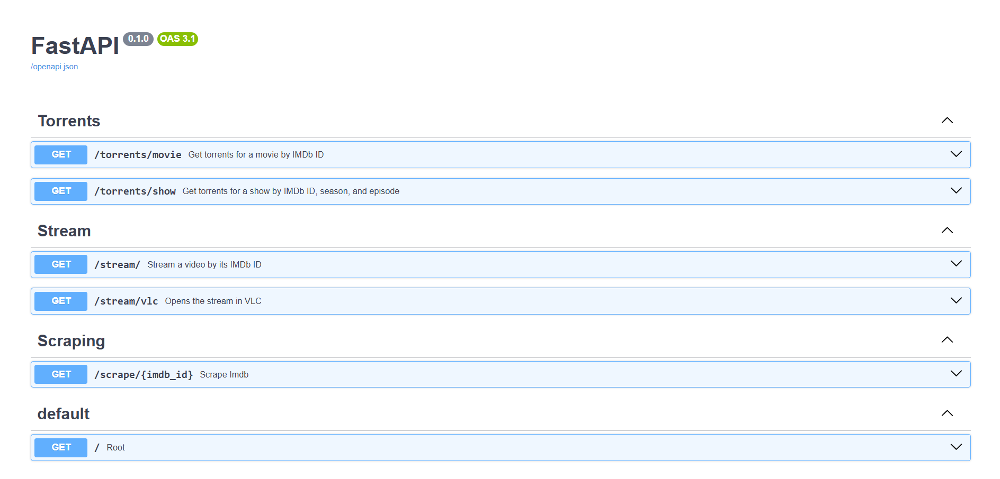

# 404Stream 🎬

<div align="center">


**Ultimate Anime Streaming Experience**

[](https://github.com/Saadiq8149/404Stream/stargazers)
[](https://github.com/Saadiq8149/404Stream/network)
[](https://github.com/Saadiq8149/404Stream/issues)
[](LICENSE)

</div>

✨ **UI Disclaimer**:
- The extension UI was built with help **Claude Sonnet v4** because writing frontend code by hand is actual psychological warfare.
- Every time I adjusted display settings or margin or widths or messed with `flex` vs `grid`, a piece of my soul disintegrated.
- Tailwind makes things “easier,” they said — *they lied*.
- So yeah, "I used a bit of AI" — *a bit he lied*. If you like the UI, great. If you don't… well, blame the AI.


## 🌟 Features

### 🎯 **Core Functionality**
- **🔍 Smart Content Discovery**: Search and stream movies & TV shows using IMDB IDs
- **⚡ Auto Torrent Selection**: Intelligent torrent ranking with quality prioritization
- **📺 VLC Integration**: Seamless streaming directly to VLC Media Player
- **🎭 Modern Anime UI**: Beautiful dark purple theme with glass-morphism design
- **📱 Browser Extension**: Convenient popup interface for quick access

### 🚀 **Advanced Features**
- **📚 Watch History**: Track watched content with episode progress
- **🎬 Movie & Series Support**: Full support for both movies and TV shows
- **🔄 Episode Navigation**: Easy season/episode selection and next episode functionality
- **🌐 Multiple Sources**: Integration with Torrentio API for reliable content sources
- **🎨 Japanese Typography**: Authentic anime aesthetic with "ストリーム" branding

### 🛠️ **Technical Stack**
- **Backend**: FastAPI (Python) with async support
- **Frontend**: React + Tailwind CSS
- **Extension**: Chrome Extension with modern UI
- **Media Player**: VLC integration for streaming
- **APIs**: IMDB scraping, Torrentio integration

## 📦 Installation

### 🔧 **Prerequisites**
- Python 3.8+
- Node.js 16+
- VLC Media Player
- Chrome/Chromium browser

### 🚀 **Quick Setup**

1. **Clone the repository**
   ```bash
   git clone https://github.com/Saadiq8149/404Stream.git
   cd 404Stream
   ```

2. **Run the automated installer**
   ```bash
   python install.py
   ```

### 🔨 **Manual Installation**

#### Backend Setup
```bash
# Navigate to project directory
cd 404Stream

# Install Python dependencies
pip install -r backend/requirements.txt

# Start the FastAPI server
cd backend
python main.py
```

#### Extension Setup
```bash
# Build the extension (if needed)
cd extension
npm install  # if using npm packages

# Load in Chrome:
# 1. Open Chrome Extensions (chrome://extensions/)
# 2. Enable Developer Mode
# 3. Click "Load unpacked"
# 4. Select the 'extension' folder
```

## 🎮 Usage

### 🎬 **Streaming Content**

1. **Find Content**: Get IMDB ID from any movie/show page
2. **Search**: Use the extension or visit IMDB to find titles
3. **Stream**: Select quality and start streaming to VLC
4. **Enjoy**: Watch with full VLC functionality

### 🔧 **Extension Interface**

#### **Main Features**
- **IMDB Search**: Direct links to IMDB for content discovery
- **Current ID Display**: Shows currently selected IMDB ID
- **Content Metadata**: Rich display with posters and details
- **Episode Selection**: Grid-based episode picker for TV shows
- **Torrent List**: Ranked torrents with quality indicators
- **Watch History**: Quick access to previously watched content

#### **Navigation**
- **Last Watched**: Jump back to recent content
- **Episode Progress**: Continue where you left off
- **Season Navigation**: Easy season/episode browsing
- **Auto Selection**: One-click best quality streaming

### 📱 **Browser Extension**

The extension provides a sleek popup interface with:
- Modern anime-inspired design
- Dark purple theme (#0e0b18 background)
- Glass-morphism effects
- Japanese typography support
- Responsive grid layout

## 🏗️ Architecture

### 📊 **System Overview**
```
┌─────────────────┐    ┌─────────────────┐    ┌─────────────────┐
│   Browser       │    │   FastAPI       │    │   External      │
│   Extension     │◄───┤   Backend       │◄───┤   APIs          │
│                 │    │                 │    │                 │
│ • React UI      │    │ • Torrent API   │    │ • Torrentio     │
│ • Tailwind CSS  │    │ • IMDB Scraper  │    │ • IMDB          │
│ • Chrome APIs   │    │ • VLC Control   │    │ • Subtitles     │
└─────────────────┘    └─────────────────┘    └─────────────────┘
         │                       │                       │
         └───────────────────────┼───────────────────────┘
                                 ▼
                    ┌─────────────────┐
                    │   VLC Media     │
                    │   Player        │
                    │                 │
                    │ • Stream Play   │
                    │ • Subtitle Sync │
                    └─────────────────┘
```

### 🗂️ **Project Structure**
```
404Stream/
├── backend/                 # FastAPI backend
│   ├── main.py             # Main server file
│   ├── requirements.txt    # Python dependencies
│   ├── routers/            # API route modules
│   │   ├── stream.py       # Streaming endpoints
│   │   └── torrents.py     # Torrent search
│   ├── services/           # Business logic
│   │   ├── torrentio.py    # Torrentio API client
│   │   ├── qbittorrent.py  # Torrent management
│   │   └── opensubs.py     # Subtitle services
│   └── downloads/          # Downloaded content
├── extension/              # Chrome extension
│   ├── manifest.json       # Extension config
│   ├── index.html          # Popup HTML
│   ├── popup.js            # Extension logic
│   └── src/                # React components
│       ├── App.jsx         # Main component
│       ├── App.css         # Styling
│       └── main.jsx        # Entry point
├── install.py              # Automated installer
└── README.md              # This file
```

## 🎨 UI/UX Features

### 🌙 **Dark Anime Theme**
- **Background**: Deep purple gradient (#0e0b18 → #1a1625)
- **Accents**: Vibrant purple highlights (#a259ff)
- **Typography**: Inter font with Japanese support
- **Effects**: Glass-morphism, soft shadows, glow effects

### 🎭 **Design Elements**
- **Wave Patterns**: Subtle animated background
- **Modern Cards**: Rounded corners with backdrop blur
- **Hover Effects**: Scale transforms and color transitions
- **Loading States**: Purple-themed spinners and animations
- **Responsive Grid**: Optimized for extension popup size

### 🔤 **Typography**
- **Main Title**: "404" in bold white
- **Japanese Subtitle**: "ストリーム" in purple
- **Content Text**: High contrast white on dark
- **UI Elements**: Consistent Inter font family

## 📸 Screenshots

### 🎨 **Extension UI Screenshots**

#### **Main Interface**


### 🔧 **API Screenshots**

#### **FastAPI Documentation**

*Interactive UI at `http://localhost:8000/docs`*

#### **Content Scraping Endpoint**
```json
GET /scrape/tt1234567
{
  "title": "Example Movie",
  "poster": "https://...",
  "is_movie": true,
  "seasons": 0,
  "episodes": [],
  "imdb_id": "tt1234567"
}
```

#### **Torrent Search Response**
```json
GET /torrents/movie/?imdb_id=tt1234567
{
  "torrents": [
    {
      "name": "Example Movie 2024 1080p BluRay x264",
      "magnet": "magnet:?xt=urn:btih:...",
      "quality": "1080p",
      "seeders": 245,
      "size": "2.1 GB",
      "file_idx": 0,
      "info_hash": "..."
    }
  ]
}
```

#### **Streaming Endpoint**
```json
GET /stream/vlc?magnet_link=...&file_idx=0
{
  "status": "success",
  "message": "VLC streaming started",
  "player_pid": 12345
}
```

### 📱 **Mobile/Responsive Views**

*Extension optimized for different screen sizes and zoom levels*

### 🎯 **Feature Highlights**

| Feature | Screenshot | Description |
|---------|------------|-------------|
| 🨠**Modern UI** |  | Glass-morphism with purple theme |
| 🔠**Smart Search** |  | IMDB integration with auto-complete |
| 📺 **VLC Integration** |  | Seamless media player control |
| 📚 **Watch History** |  | Persistent episode tracking |
| ⚡ **Auto Select** |  | Intelligent torrent ranking |

> **Note**: Screenshots are located in the `/screenshots` directory. For the latest UI updates, please refer to the live extension interface.

## ⚙️ Configuration

### 🔧 **Backend Configuration**
```python
# backend/main.py
BASE_BACKEND_URL = 'http://127.0.0.1:8000'
```

### 🌐 **API Endpoints**
- `GET /scrape/{imdb_id}` - Fetch content metadata
- `GET /torrents/movie/` - Search movie torrents
- `GET /torrents/show/` - Search TV show torrents
- `GET /stream/vlc` - Start VLC streaming

### 🎛️ **Extension Settings**
- Automatic IMDB ID detection
- VLC integration settings
- Watch history persistence
- Quality preferences

## 🤝 Contributing

We welcome contributions! Here's how to get started:

### 🔀 **Development Workflow**
1. Fork the repository
2. Create a feature branch (`git checkout -b feature/amazing-feature`)
3. Commit your changes (`git commit -m 'Add amazing feature'`)
4. Push to the branch (`git push origin feature/amazing-feature`)
5. Open a Pull Request

### 🐛 **Bug Reports**
Please use the [GitHub Issues](https://github.com/Saadiq8149/404Stream/issues) page to report bugs with:
- Detailed description
- Steps to reproduce
- Expected vs actual behavior
- Screenshots (if applicable)

### 💡 **Feature Requests**
We love new ideas! Open an issue with:
- Clear feature description
- Use case examples
- Implementation suggestions

## 📄 License

This project is licensed under the MIT License - see the [LICENSE](LICENSE) file for details.

## ⚠️ Disclaimer

404Stream is for educational purposes only. Users are responsible for complying with their local laws regarding content streaming and torrent usage. Always respect copyright and intellectual property rights.

## 🌟 Acknowledgments

- **VLC Media Player** - For excellent media playback
- **Torrentio** - For torrent indexing services
- **IMDB** - For comprehensive media database
- **FastAPI** - For the robust backend framework
- **React** - For the modern frontend experience
- **Tailwind CSS** - For the beautiful styling system

---

<div align="center">

**Made with 💜 by the 404Stream Team**

[⭐ Star this repo](https://github.com/Saadiq8149/404Stream) | [🐛 Report Bug](https://github.com/Saadiq8149/404Stream/issues) | [💡 Request Feature](https://github.com/Saadiq8149/404Stream/issues)

</div>
